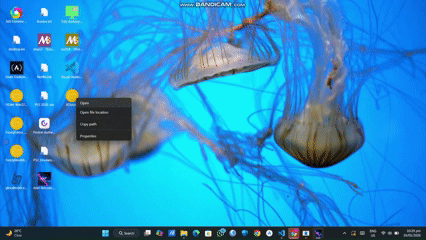

# RT-Wallpaper-Windows
## Real-Time Wallpaper for Windows

A Python application that lets you run **live, interactive wallpapers** on your Windows desktop.  
Draws directly onto the desktop using system APIs, providing a dynamic and customizable desktop experience.

---

## Demo
Watch it in action:

  
*Or link to a short video if GIF is too large:*

<video width="640" height="360" controls>
  <source src="assets/demo.mp4" type="video/mp4">
  Your browser does not support the video tag.
</video>

---

## Features
- Real-time wallpapers on Windows
- Draws dynamic content directly onto the desktop
- Lightweight web interface via Flask + PyWebview
- Image manipulation and processing using Pillow
- Fully customizable animations and images

---

## Tech Stack
- Python 3.12.8
- [PyWebview](https://github.com/r0x0r/pywebview) – GUI layer for lightweight web UI  
- [PyWin32](https://github.com/mhammond/pywin32) – Desktop integration for drawing  
- [Flask](https://flask.palletsprojects.com/) – Web server to handle UI and controls  
- [Pillow](https://python-pillow.org/) – Image processing library  

---

## Installation (Prebuilt Software)
1. Download the latest release from the [Releases page](https://github.com/its-ernest/rt-wallpaper-windows/releases)  
2. Run the executable and follow on-screen instructions  

---

## Installation (From Source)
```bash
git clone https://github.com/its-ernest/rt-wallpaper-windows.git
cd rt-wallpaper-windows
pip install -r requirements.txt
python main.py
